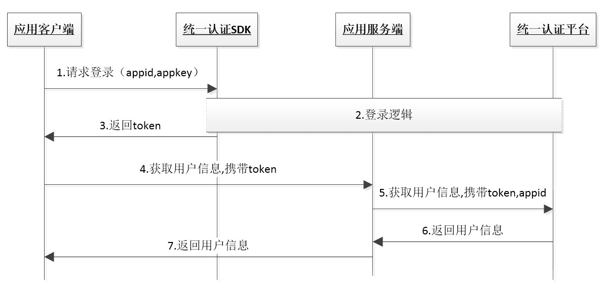

# 1. 开发环境配置

## 1.1. 环境配置及发布

1. 导入统一认证framework

直接将统一认证`TYRZSDK.framework`拖到项目中


2. 在Xcode中找到`TARGETS-->Build Setting-->Linking-->Other Linker Flags`在这选项中需要添加`-ObjC`


3. TARGETS-->Build Setting-->搜索框中搜索"BitCode"选项,并且将该选项的属性设置为NO


## 1.2. Hello 统一认证

本节内容主要面向新接入统一认证的开发者，介绍快速集成统一认证的基本服务的方法。

### 1.2.1. 统一认证登录流程



由流程图可知，业务客户端集成SDK后只需要完成2步集成实现登录

```
1.	调用登录接口获取token
2.	携带token请求登录
```

### 1.2.2. 统一认证登录集成步骤

**第一步：**

在appDelegate.m中的didFinish函数中添加初始化代码。初始化代码只需要执行一次就可以。

```objective-c
- (BOOL)application:(UIApplication *)application didFinishLaunchingWithOptions:(NSDictionary *)launchOptions {
    // Override point for customization after application launch.
     [TYRZBaseApi customInit:APPID appKey:APPKEY sourceID:SOURCEID];
    return YES;
}
```

**第二步：**

在需要用到登录的地方调用登录接口即可，以下是登录示例

```objective-c
- (void)showImplicitLogin {
    self.waitBGV.hidden = NO;
    [self.waitAV startAnimating];
     __weak typeof(self) weakSelf = self;
    [TYRZLogin loginImplicitly:^(id sender) {
        dispatch_async(dispatch_get_main_queue(), ^{
            weakSelf.waitBGV.hidden = YES;
            [weakSelf.waitAV stopAnimating];
            NSString *resultCode = sender[@"resultCode"];
            self.token = sender[@"token"];
            NSMutableDictionary *result = [NSMutableDictionary dictionaryWithDictionary:sender];
            if ([resultCode isEqualToString:SUCCESSCODE]) {
                result[@"result"] = @"获取token成功";
            } else {
                result[@"result"] = @"获取token失败";
            }
            [self showInfo:result];
        });
    }];
}
```

<div STYLE="page-break-after: always;"></div>

#2.SDK方法描述

## 2.1. 获取token

### 2.1.1. 方法说明

**功能**

隐式登录方法，用户打开APP，直接完成登录，不需要用户确认，仅提供伪码给业务侧，无法获取用户手机号码。

**原型**

TYRZLogin -> loginImplicitly

```objective-c
+ loginImplicitlyWithAppId:(NSString *)appid
                          appkey:(NSString *)appkey
                          capaId:(NSString *)capaId
                      capaIdTime:(NSString *)capaIdTime
                        complete:(void (^)(id sender))complete;
```

### 2.1.2. 参数说明

**请求参数**

| 参数         | 类型            | 说明              | 是否必填 |
| ---------- | ------------- | --------------- | ---- |
| appid      | NSString      | 开放平台申请得到的appid  | 是    |
| appkey     | NSString      | 开放平台申请得到的appkey | 是    |
| capaId     | NSString.     | 授权列表            | 是    |
| capaidTime | NSString.     | 当前时间            | 是    |
| complete   | UAFinishBlock | 登录回调            | 是    |

**响应参数**

| 参数          | 类型         | 说明             | 是否必填  |
| ----------- | ---------- | -------------- | ----- |
| resultCode  | NSUinteger | 返回相应的结果码       | 是     |
| token       | NSString   | 登录时需要的token    | 成功时必填 |
| openid      | NSString   | 成功时返回：用户身份唯一标识 | 成功时必填 |
| authType    | NSString   | 认证类型(详见附录1)    | 成功时必填 |
| authTypeDes | NSString   | 认证类型描述(详见附录1)  | 成功时必填 |
| desc        | NSString   | 调用描述           | 否     |

### 2.1.3. 示例

**请求示例代码**

``` java
/**
 隐式登录
 */
-- (IBAction)loginimplicit:(id)sender {
    
    NSTimeInterval Now = [[NSDate date]timeIntervalSince1970]*1000;
    long long theTime = [[NSNumber numberWithDouble:Now] longLongValue];
    NSString *capaidTime = [NSString stringWithFormat:@"%llu",theTime];
    
    [TYRZLogin loginImplicitlyWithAppId:APPID
                                 appkey:APPKEY
                                 capaId:@"200"
                             capaIdTime:capaidTime
                               complete:^(id sender) {
        NSString *resultCode = sender[@"resultCode"];
        self.token = sender[@"token"];
        NSMutableDictionary *result = [NSMutableDictionary dictionaryWithDictionary:sender];
        if ([resultCode isEqualToString:CLIENTSUCCESSCODECLIENT]) {
            result[@"result"] = @"获取token成功";
        } else {
            result[@"result"] = @"获取token失败";
        }
        [self showInfo:result];
    }];
```

**响应示例代码**

```
{
    authType = 2;
    resultCode = 103000;
    openId = "lcIvEt9u1RRBwr8richVcbEUzzrm6IaFXNPWPejB2b3O_vVIkAwI";
    authToeDes = @"网关鉴权"
    result = @"获取token成功"
    token = 84840100013202003A516B55354D6B4A434D4467304D5456434F4441334D30553040687474703A2F2F3132302E3139372E3233352E32373A383038302F72732F403031030004031A1A9B040012383030313230313730383137313031343230FF00200970BFEA09AEF18EEDCF32A4F960412E9AA5DE9A21DF7DC669E4D27E3519A1A4
}
```
## 2.2. 获取SDK内部异常的信息

### 2.2.1. 方法说明

**功能**

监听SDK内部异常的信息

**原型**

TYRZLogin -> kTYRZNotificationKeyLog

```objective-c

@property (nonatomic,class,readonly) NSString *kTYRZNotificationKeyLog;

```
### 2.2.2. 使用说明

[NSNotificationCenter.defaultCenter addObserver:self selector:@selector(observeSDKException:) name:TYRZLogin.kTYRZNotificationKeyLog object:nil];

- (void)observeSDKException:(NSNotification *)sender {
    
    //异常的信息以NSDictionary传回到sender.object
    NSDictionary __unused *exceptionDict = sender.object;
}

### 2.2.3. 返回字典结构

```
@{@"message":message}

```
**参数说明**

| 参数        | 类型         | 
| ---------- | ------------- | 
| message    | NSString或者NSError | 


<div STYLE="page-break-after: always;"></div>

# 3. 平台接口说明

## 3.1. 获取用户信息接口

### 3.1.1. 接口说明

业务平台或服务端携带用户授权成功后的token来调用统一认证服务端获取用户信息。

### 3.1.2. 接口描述

**请求地址：**https://www.cmpassport.com/unisdk/rsapi/tokenValidate

**协议：**HTTPS

**请求方法：**POST+JSON

### 3.1.3.参数说明

**请求参数**

| 参数名称          | 约束      | 层级    | 参数类型   | 说明                                       |
| ------------- | ------- | ----- | ------ | ---------------------------------------- |
| **header**    | **必选**  | **1** |        |                                          |
| version       | 必选      | 2     | string | 填1.0                                     |
| msgid         | 必选      | 2     | string | 标识请求的随机数即可(1-36位)                        |
| systemtime    | 必选      | 2     | string | 请求消息发送的系统时间，精确到毫秒，共17位，格式：20121227180001165 |
| strictcheck   | 必选      | 2     | string | 验证源ip合法性，填写”1”，统一认证会校验sourceid与出口ip对应关系（申请sourceid时需提供业务出口ip，可以多个IP） |
| sourceid      | 可选      | 2     | string | 业务集成统一认证的标识，需提前申请                        |
| ssotosourceid | 可选      | 2     | string | 单点登录时使用，填写被登录业务的sourceid                 |
| appid         | 必选      | 2     | string | 业务在统一认证申请的应用id                           |
| apptype       | 必选      | 2     | string | 1:BOSS<br />2:web<br />3:wap<br />4:pc客户端<br />5:手机客户端 |
| expandparams  | 扩展参数    | 2     | Map    | map(key,value)                           |
| **body**      | **必选**  | **1** |        |                                          |
| sign          | 当有密钥时必填 | 2     | String | 签名HMAC（appid+token）,key使用支付宝提供的公钥        |
| token         | 必选      | 2     | string | 需要解析的凭证值。                                |

**请求示例**

```
{
    "header": {
        "strictcheck": "0",
        "version": "1.0",
        "msgid": 	"40a940a940a940a93b8d3b8d3b8d3b8d",
        "systemtime": "20170515090923489",
        "appid": "10000001",
        "apptype": "5"
    },
    "body": {
 		"token":
"8484010001320200344E6A5A4551554D784F444E474E446C434E446779517A673340687474703A2F2F3139322E3136382E31322E3233363A393039302F0300040353EA68040006313030303030FF00203A020A143C6703D7D0530953C760744C7D61F5F7B546F12BC17D65254878748C"
    }
}
```

**响应参数**

| 参数名称                | 约束     | 层级    | 参数类型   | 说明                                       |
| ------------------- | ------ | ----- | ------ | ---------------------------------------- |
| **header**          | **必选** | **1** |        |                                          |
| version             | 必选     | 2     | string | 1.0                                      |
| inresponseto        | 必选     | 2     | string | 对应的请求消息中的msgid                           |
| systemtime          | 必选     | 2     | string | 响应消息发送的系统时间，精确到毫秒，共17位，格式：20121227180001165 |
| resultCode          | 必选     | 2     | string | 返回码，返回码对应说明见附录二                          |
| **body**            | **必选** | **1** |        |                                          |
| userid              | 必选     | 2     | string | 系统中用户的唯一标识                               |
| pcid                | 必选     | 2     | string | 伪码id（显示和隐试登录都有）                          |
| usessionid          | 可选     | 2     | string | 暂忽略                                      |
| passid              | 可选     | 2     | string | 用户统一账号的系统标识                              |
| andid               | 可选     | 2     | string | 用户的“和ID”                                 |
| msisdn              | 可选     | 2     | string | 表示手机号码(1.返回手机号已新增校验逻辑新校验地址：[返回手机号适配逻辑](http://120.197.235.101:8090/pages/viewpage.action?pageId=3115524)  2.当appid有支付宝提供的密钥时，手机号加密返回，（使用AES加密，key为支付宝提供的公钥截取前16位） ) |
| email               | 可选     | 2     | string | 表示邮箱地址                                   |
| loginidtype         | 可选     | 2     | string | 登录使用的用户标识：</br>0：手机号码</br>1：邮箱           |
| msisdntype          | 可选     | 2     | string | 手机号码的归属运营商：</br>0：中国移动</br>1：中国电信</br>2：中国联通</br>99：未知的异网手机号码 |
| province            | 可选     | 2     | string | 用户所属省份(暂无)                               |
| authtype            | 可选     | 2     | string | 认证方式，取值参见附录三                             |
| authtime            | 可选     | 2     | string | 统一认证平台认证用户的时间                            |
| lastactivetime      | 可选     | 2     | string | 暂无                                       |
| relateToAndPassport | 可选     | 2     | string | 是否已经关联到统一账号，暂无用处                         |
| fromsourceid        | 可选     | 2     | string | 来源sourceid（即签发token sourceid）            |
| tosourceid          | 可选     | 2     | string | 目的sourceid（即被登录业务sourceid）               |

**响应示例**

```
{
    "body": {
        "msisdntype": "0",
        "usessionid": "NjZEQUMxODNGNDlCNDgyQzg3@http://192.168.12.236:9090/",
        "passid": "000000000",
        "loginidtype": "0",
        "authtime": "2017-05-22 20:48:45",
        "msisdn": "13683329795",
        "lastactivetime": "",
        "authtype": "WAPGW",
        "relateToAndPassport": "1"
    },
    "header": {
        "inresponseto": "40a940a940a940a93b8d3b8d3b8d3b8d",
        "resultcode": "103000",
        "systemtime": "20170522204845598",
        "version": "1.0"
    }
}
```


<div STYLE="page-break-after: always;"></div>

# 4. 平台返回码说明

## 4.1. 平台返回码

| 错误编号   | 返回码描述                |
| ------ | -------------------- |
| 103101 | 签名错误                 |
| 103103 | 用户不存在                |
| 103104 | 用户不支持该种登录方式          |
| 103105 | 密码错误                 |
| 103106 | 用户名错误                |
| 103107 | 已存在相同的随机数            |
| 103108 | 短信验证码错误              |
| 103109 | 短信验证码超时              |
| 103111 | WAP网关IP不合法           |
| 103112 | 请求错误 reqError        |
| 103113 | Token内容错误            |
| 103114 | token验证 KS过期         |
| 103115 | token验证 KS不存在        |
| 103116 | token验证 sqn错误        |
| 103117 | mac异常 macError       |
| 103118 | sourceid不存在          |
| 103119 | appid不存在appidNOExist |
| 103120 | clientauth不存在        |
| 103121 | passid不存在            |
| 103122 | btid不存在              |
| 103123 | redisinfo不存在         |
| 103124 | ksnaf校验不一致           |
| 103125 | 手机格式错误               |
| 103126 | 手机号不存在               |
| 103127 | 证书验证，版本过期            |
| 103128 | gba webservice接口调用失败 |
| 103129 | 获取短信验证码的msgtype异常    |
| 103130 | 新密码不能与当前密码相同         |
| 103131 | 密码过于简单               |
| 103132 | 用户注册失败               |
| 103133 | sourceid不合法          |
| 103134 | wap方式手机号为空           |
| 103135 | 昵称非法                 |
| 103136 | 邮箱非法                 |
| 103138 | appid已存在             |
| 103139 | sourceid已存在          |
| 103200 | 不需要更新ks              |
| 103204 | 缓存随机数不存在             |
| 103205 | 服务器内部异常              |
| 103207 | 发送短信失败               |
| 103212 | 校验密码失败               |
| 103213 | 旧密码错误                |
| 103214 | 访问缓存或数据库错误           |
| 103226 | sqn过小或过大             |
| 103265 | 用户已存在                |
| 103901 | 短信验证码下发次数已达上限        |
| 103902 | 凭证校验失败               |
| 104001 | APPID和APPKEY已存在      |
| 105001 | 联通网关取号失败             |
| 105002 | 移动网关取号失败             |
| 105003 | 电信网关取号失败             |
| 105004 | 短信上行ip检测不合法          |
| 105005 | 短信上行发送信息为空           |
| 105006 | 手机号码为空               |
| 105007 | 手机号码格式错误             |
| 105008 | 短信内容为空               |
| 105009 | 解析失败                 |

</br>

## 4.2. SDK返回码说明

| 错误编号   | 返回码描述                |
| ------ | -------------------- |
| 103000 | 成功                   |
| 102101 | 无网络                  |
| 102102 | 网络异常                 |
| 102223 | 数据解析异常               |
| 102121 | 用户取消认证               |
| 102505 | 业务未注册                |
| 102506 | 请求出错                 |
| 102507 | 请求超时                 |
| 102201 | 自动登陆失败               |
| 102202 | 应用签名失败               |
| 102203 | 输入参数错误               |
| 102204 | 正在gettoken处理         |
| 102210 | 指定号码非本机号码            |
| 102211 | 短信验证码验证成功后返回随机码为空    |
| 102222 | http响应头中没有结果码        |
| 102299 | other failed         |
| 102302 | 调用service超时          |
| 103117 | mac异常 macError       |
| 103200 | ks无需更新               |
| 103203 | 缓存用户不存在              |
| 200001 | imsi为空，跳到短信验证码登录     |
| 200002 | imsi为空，没有短信验证码登录功能   |
| 200003 | 复用中间件首次登录            |
| 200004 | 复用中间件二次登录            |
| 200005 | 用户未授权                |
| 200006 | 用户未授权                |
| 200007 | 不支持的认证方式 跳到短信验证码登录   |
| 200008 | 不支持的认证方式 没有短信验证码登录功能 |
| 200009 | 应用合法性校验失败            |

<div STYLE="page-break-after: always;"></div>

# 附录1 认证方法标识

| authType | authTypeDes        |
| -------- | ------------------ |
| 0        | 其他（超时无法确认认证类型，返回0） |
| 1        | WIFI下网关鉴权          |
| 2        | 网关鉴权               |
| 3        | 短信上行鉴权             |
| 4        | WIFI下网关鉴权复用中间件登录   |
| 5        | 网关鉴权复用中间件登录        |
| 6        | 短信上行鉴权复用中间件登录      |
| 7        | 短信验证码登录            |
